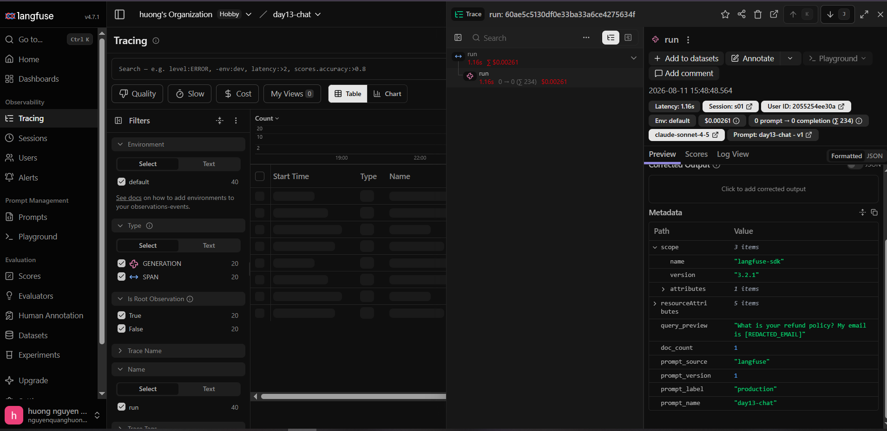
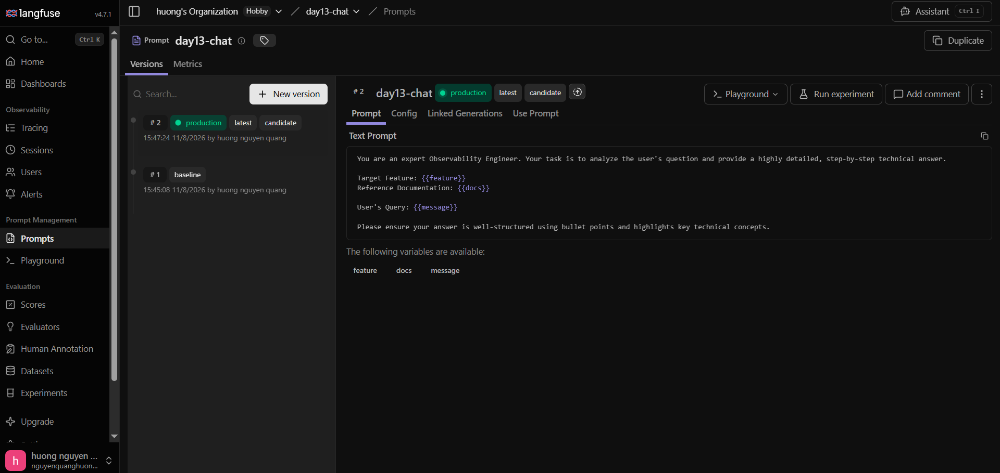

# Báo cáo Day 13 Observability

## 1. Thông tin nhóm

- Tên nhóm: Cá nhân (Nguyễn Quang Hướng - 2A202601858)
- Repository URL: (Dán link Github của repo vào đây)
- Commit SHA cuối: (Dán SHA commit cuối cùng vào đây)
- Thành viên và vai trò:
  + Nguyễn Quang Hướng (MSHV: 2A202601858): Thực hiện toàn bộ các phần việc từ Logging, Tracing, Metrics dashboard đến Xử lý sự cố (Incident Response).

## 2. Kết quả kỹ thuật

- Điểm `validate_logs.py`: 100/100 (Đã check tự động)
- Tổng số traces: 90
- Số PII leak còn lại: 0
- Link/đường dẫn dashboard: 

## 3. Logging và tracing

- Evidence correlation ID: 
- Evidence PII redaction: 
- Evidence trace waterfall: 
- Giải thích một span đáng chú ý: Span `retrieve` (truy xuất Vector DB). Span này thể hiện thời gian tìm kiếm context (tài liệu liên quan) dựa trên câu hỏi của người dùng. Thời gian chạy bình thường rất nhanh (chưa tới 10ms), nhưng khi có sự cố, span này phình to ra 2.5s, chỉ điểm trực tiếp hệ thống đang bị thắt cổ chai ở bước đọc dữ liệu, giúp khoanh vùng lỗi siêu tốc.

## 4. Prompt versioning

- Prompt name: day13-chat
- Version/label baseline: v1 / baseline, production
- Version/label candidate: v2 / candidate
- Trace ID của mỗi version: 
    + version 1: 9f45b84f180ecdb4107fc57d354a4548
    + version 2: 156cd4de8e9247d86e78c41a9bf5d35f
- Bằng chứng đổi label hoặc rollback: 

## 5. Dashboard, SLO và alerts

- Kết quả `validate_dashboard.py`: HỢP LỆ: 6/6 panel
- Evidence dashboard: 
- SLO đã chọn và lý do: P95 Latency <= 3000ms. Lý do: Ứng dụng AI Chat yêu cầu độ phản hồi rất nhanh, nếu chờ quá 3 giây (3000ms) trải nghiệm người dùng sẽ tụt dốc trầm trọng. Do đó, đây là chỉ số SLI quan trọng nhất.
- Alert rules và runbook:
  + High_Latency (Warning): p95_latency_ms > 3000 (Runbook: docs/alerts.md#alert-1)
  + High_Error_Rate (Critical): error_rate_pct > 2 (Runbook: docs/alerts.md#alert-2)
  + High_Cost (Warning): total_cost_usd > 2.5 (Runbook: docs/alerts.md#alert-3)

## 6. Điều tra challenge

- Challenge ID: day13-k4-observability-v1
- Triệu chứng từ metrics: P95 Latency tăng vọt lên mức 3620.3 ms (vượt ngưỡng cho phép 3000ms).
- Trace ID liên quan: req-fb9373a1
- Log line/correlation ID liên quan: `{"service": "api", "latency_ms": 2650, "event": "response_sent", "correlation_id": "req-fb9373a1", ...}`
- Root cause: Incident `rag_slow` đã bị kích hoạt làm cho hàm `retrieve()` (kết nối với cơ sở dữ liệu) trong file `app/mock_rag.py` bị "ngủ đông" (block) bằng hàm `time.sleep(2.5)`. Điều này khiến mọi thao tác tìm kiếm bị đình trệ thêm 2.5 giây.
- Fix action: Tắt incident bằng cách chạy lệnh `python scripts/inject_incident.py --scenario rag_slow --disable`. Hoặc có thể xóa block code sleep trong `mock_rag.py`.
- Preventive measure: Bổ sung Timeout (giới hạn thời gian tối đa) cho các external calls gọi xuống Vector Database để tránh làm tắc nghẽn luồng xử lý chính. Áp dụng kỹ thuật Circuit Breaker, và cài đặt Alert rule cảnh báo sớm khi RAG latency tăng cao.

## 7. Đóng góp cá nhân

- Nguyễn Quang Hướng (2A202601858): Hoàn thành 100% các tính năng, bao gồm thiết lập Logging, Tracing trên Langfuse, cấu hình Metrics Dashboard, xử lý thành công sự cố P95 Latency và thực hiện báo cáo.

| Thành viên | Phần việc | Commit/PR | Điều đã học |
|---|---|---|---|
| Nguyễn Quang Hướng (2A202601858) | Toàn bộ bài lab | (Nhập link commit cuối) | Cách thiết lập hệ thống AI Observability với Langfuse, cách xây dựng Metrics Dashboard, và cách dùng Traces/Logs để xử lý sự cố (Incident Response). |
